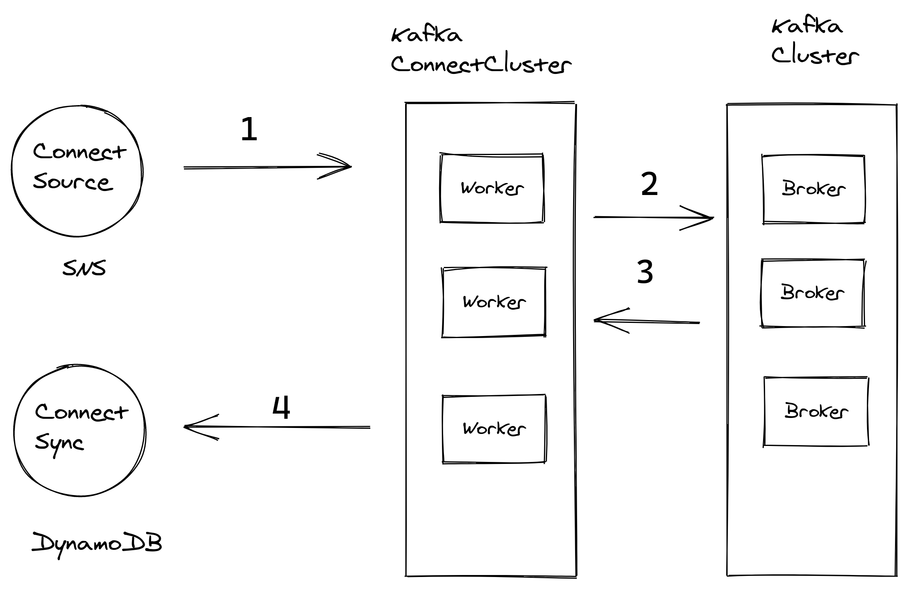

# awesome-realtime
POC getting real-time data streams from SNS topic and put data into Kafka ending up into DynamoDB

Architecture Big Picture

Stack
* SNS 
* SQS
* Apache Kafka + Kafka Connectors
* DynamoDB

The local setup to run is based in docker-compose

Ports
* SNS : 9911
* SQS : 9324
* SQS-UI: 9325
* Zookeeper: 2181
* Landoop UI: 3030
* Rest Proxy, Schema Registry: 8081, 8083
* JMX Ports: 9581, 9585
* Kafka Broker: 9092
* DynamoDB: 8000

## Run
> docker-compose up --build

References:
* [SQS Connector Plugin](https://www.confluent.io/hub/confluentinc/kafka-connect-sqs)
* [Local SQS](https://github.com/roribio/alpine-sqs)
* [Local SNS](https://github.com/s12v/sns)
* [Local DynamoDB](https://hub.docker.com/r/amazon/dynamodb-local/)
* [Local Apache Kafka](https://hub.docker.com/r/landoop/fast-data-dev/)